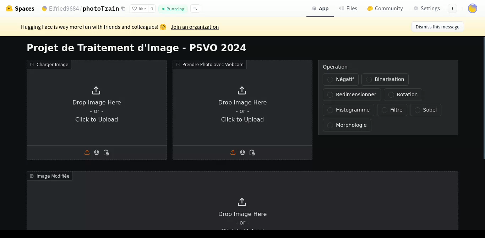
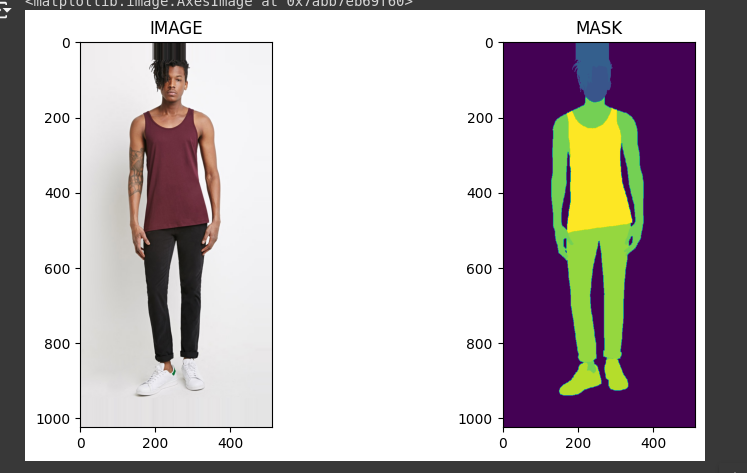

# Data Scientist - Elfried Kinzoun
### À Propos
Je suis un passionné de l'intelligence artificielle avec une solide compréhension des concepts fondamentaux de l'IA. Mon objectif est de continuer à explorer et à développer mes compétences pour créer des solutions innovantes pour l'avenir. Je me spécialise dans la robotique, le développement web et l'analyse de données, et je suis toujours à la recherche de nouveaux défis dans ces domaines.
---
### Éducation
- **2023 - 2024 : Licence 2**  
  Institut de Formation et de Recherche en Informatique (IFRI)  
  Bénin, Abomey-Calavi
- **2022 - 2023 : Licence 1**  
  Institut de Formation et de Recherche en Informatique (IFRI)  
  Bénin, Abomey-Calavi
- **2021 - 2022 : Baccalauréat**  
  CPEG Le Pharaon, Bénin
---
### Expérience Professionnelle
- **2023 : Hackathon Multimodal (Projet Agritube)**  
  Membre de l'équipe Olympus IA, j'ai participé au développement de la solution Agritube, visant à faciliter l'apprentissage des agriculteurs dans les régions éloignées en langue fon. Ce projet a été sélectionné parmi les 10 premiers lors d'un concours national.
- **2019 - 2020 : Tekbot Robotic Challenge (Projet SCOP)**  
  Développement d'un robot capable de trier des déchets en fonction des couleurs de poubelles, nous permettant de remporter le Challenge de Robotique SCOP.
- **2017 - 2019 : Gestionnaire d’École (IFRI)**  
  Responsable de la gestion et de l'envoi de bulletins scolaires aux parents via une application web basée sur le framework Laravel.
- **2016 - 2017 : Projet Personnel Pan_Card**  
  Développement d'une application Flask pour la détection de cartes d'identité contrefaites.
---
### Projets
- **Agritube (Hackathon Multimodal)**  
  Une solution innovante visant à faciliter l'accès à des informations agricoles pour les agriculteurs dans des régions reculées en utilisant une approche multimodale.
- **TimePlaner (IFRI)**  
  Développement d'une application web pour la gestion des emplois du temps étudiants avec Django.
- **Projet SCOP**  
  Développement d'un robot triant des déchets en fonction des couleurs pour améliorer la gestion des déchets.
- **Pan_Card**  
  Application web visant à détecter les cartes d'identité contrefaites.

- Projet : Mini Photoshop avec Gradio

## Description

Ce projet fait partie d'un défi hebdomadaire dans lequel je développe chaque semaine un projet de vision par ordinateur. Pour cette semaine, j'ai réalisé une application de traitement d'image appelée **Mini Photoshop**. Cette application permet d'appliquer différentes transformations d'images via une interface simple et intuitive créée avec **Gradio**. Le projet a été déployé sur **Hugging Face** afin de le rendre accessible en ligne.

## Fonctionnalités

- **Chargement d'image** : L'utilisateur peut importer une image à partir de son appareil.
- **Transformation d'image** :
  - Négatif
  - Binarisation
  - Redimensionnement
  - Rotation
  - Affichage d'histogramme
  - Extraction de contours
  - Opérations morphologiques
- **Capture via Webcam** : L'utilisateur peut utiliser la webcam pour capturer une photo et appliquer les transformations.
- **Téléchargement** : Possibilité de télécharger l'image transformée.

## Technologies Utilisées

- **Python**
- **Gradio** : Pour l'interface utilisateur.
- **OpenCV** : Pour les transformations d'images.
- **PIL** (Python Imaging Library) : Pour certaines opérations de traitement d'images.
- **Hugging Face Spaces** : Pour le déploiement de l'application.

## Installation et Utilisation

### Pré-requis

- Python 3.x
- Gradio
- OpenCV
- PIL

Vous pouvez tester l'application en ligne via ce lien : [Lien Hugging Face]( https://github.com/elfried96/elf_data-scient/tree/main).

# FitForAll

✨ **FitForAll : Promouvoir l'inclusivité dans la mode grâce à l'intelligence artificielle** ✨

### Contexte
L'industrie de la mode a longtemps été critiquée pour son manque d'inclusivité, notamment en ce qui concerne la diversité des corps et des ethnies. FitForAll vise à combler cette lacune en proposant une approche technologique pour analyser les vêtements selon différents types de morphologies et d'ethnies.

### Objectif
Développer une application web capable de recommander des styles vestimentaires en fonction de la morphologie et de l'ethnie des utilisateurs, en utilisant des techniques de segmentation d'images et d'intelligence artificielle.

### Avancement
Cette semaine, nous avons travaillé sur un modèle de segmentation d'images et produit un MVP. Voici une capture de l'interface :

### Prochaines étapes
- Amélioration de l'interface utilisateur
- Test et ajustement du modèle de recommandation

---
### Compétences
- **Langages de programmation :** C, C++, Java, Python
- **Base de données :** SQL
- **Développement web :** HTML, CSS, JavaScript, PHP
- **Frameworks :** Django, Laravel, Flask, React
- **Analyse de données :** Pandas, NumPy, Scikit-learn, TensorFlow
- **Outils :** Word, Excel, PowerPoint, Ms Project
- **Permis de conduire :** Catégorie B
---
### Contact
- **Email :** ekfriedkinzoun@gmail.com  
- **Téléphone :** +229 96848729  
- **Localisation :** Bénin, Abomey-Calavi
---
### Langues
- Français : 80%  
- Anglais : 40%
